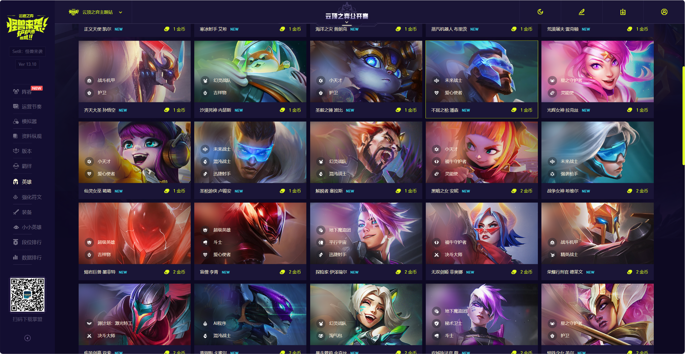
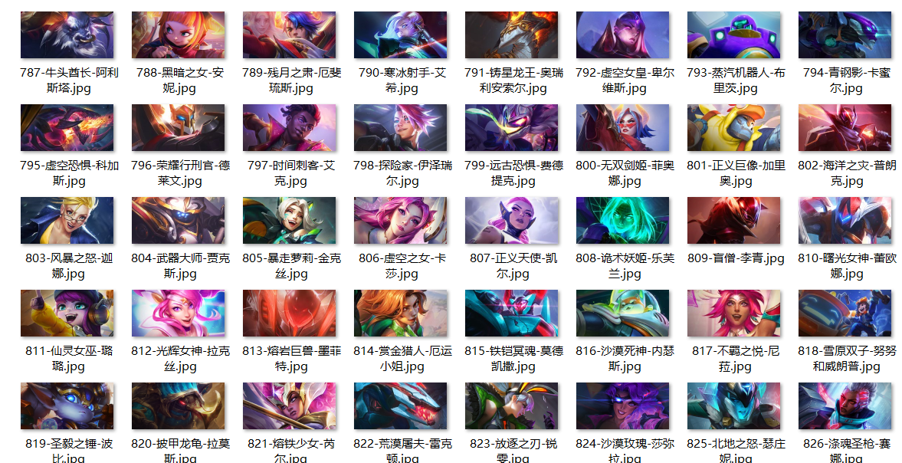
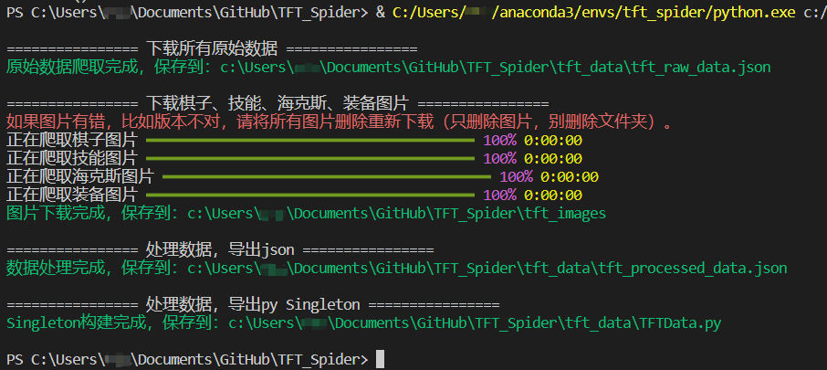

# TFT_Spider

能够爬取云顶之弈棋子、装备、海克斯、技能图片和数据，并处理成方便使用格式（json）的爬虫工具。

数据来源：[腾讯官方云顶之弈主题站](https://lol.qq.com/tft/#/champion)

## 为了方便伸手党...

1. 为了方便伸手党，所有数据已经下载好，并保存在`tft_data`和`tft_images`文件夹中。
2. `clone`此项目即可得到所有数据，无需运行代码。
3. 如果赛季过期，请在`issue`里提醒作者更新数据，方便伸手党使用。
4. 当前更新到：S8-怪兽入侵。S8.5预计2023.3.24上线。

## 爬取数据内容

运行`python main.py`后，可以得到如下内容

1. 云顶的棋子、装备、海克斯、技能的图片，放到`tft_images`目录下。
   
   

2. 云顶官方数据，放到`tft_data/tft_raw_data.json`文件中，样例如下
    

    
点击查看 tft_raw_data.json 内容示例。注意，为了方便阅读这里只展示部分数据。

    <pre><code class="language-json">{
    "version_config": {
        "赛季名称": "s8-怪兽来袭",
        "版本信息": "13.5",
        "爬取日期": "2023-03-14",
    },
    "race": [{
            "raceId": "8101",
            "name": "AI程序",
            "traitId": "8101",
            "introduce": "【AI程序】在每局游戏中对每个玩家的配置都不同。",
            "alias": "8101.png",
            "level": {
                "2": "初始化【AI程序】的条件和结果]",
                "4": "[对程序添加另一个结果]",
                "6": " 前几个层级的加成提升200%"
            },
            "TFTID": "8101",
            "imagePath": "https://game.gtimg.cn/images/lol/act/img/tft/origins/8101.png",
            "race_color_list": "2:1,4:2,6:3"
        }],
    "job": [{
            "jobId": "8001",
            "name": "精英战士",
            "traitId": "8001",
            "introduce": "这个羁绊仅会在你恰好拥有1个或4个独特的【精英战士】弈子时激活。",
            "alias": "8001.png",
            "level": {
                "1": "处决低于15%生命值的敌人",
                "4": "处决低于30%生命值的敌人"
            },
            "TFTID": "8001",
            "imagePath": "https://game.gtimg.cn/images/lol/act/img/tft/classes/8001.png",
            "job_color_list": "1:1,4:3"
        }],
    "equip": [{
            "equipId": "201",
            "type": "2",
            "name": "幽梦之灵",
            "effect": "携带者也是一名刺客",
            "keywords": "攻击力，转职，暴击",
            "formula": "301,308",
            "imagePath": "https://game.gtimg.cn/images/lol/act/img/tft/equip/201.png",
            "TFTID": "2001",
            "jobId": "3",
            "raceId": "0",
            "proStatus": "无",
            "isShow": "0"
        }],
    "hex": [{
            "id": "7351",
            "hexId": "2415",
            "type": "1",
            "name": "开摆",
            "imgUrl": "https://game.gtimg.cn/images/lol/act/img/tft/hex/20220531155500HEX6295c9d41fbf3.PNG",
            "fetterId": "0",
            "fetterType": "0",
            "augments": "TFT7_Augment_AFK",
            "hero_EN_name": "",
            "isShow": "1",
            "hero_enhancement_type": "0",
            "description": "你在接下来的3回合里无法采取任何行动。在此之后，获得18金币。",
            "createTime": "2023-03-08 15:55:40"
        }],
    "chess": [{
            "chessId": "1",
            "title": "黑暗之女",
            "name": "788.png",
            "displayName": "安妮",
            "raceIds": "8108,8105",
            "jobIds": "8014",
            "price": "2",
            "skillName": "爆裂护盾",
            "skillType": "主动",
            "skillImage": "https://game.gtimg.cn/images/lol/act/img/tft/champions/annie-burst-shield.png",
            "skillIntroduce": "【安妮】用火焰引爆一个锥形区域，对她前方的敌人造成140/210/325魔法伤害，然后给自己生成300/350/425护盾值，持续4秒。",
            "skillDetail": "【安妮】用火焰引爆一个锥形区域，对她前方的敌人造成140/210/325魔法伤害，然后给自己生成300/350/425护盾值，持续4秒。",
            "life": "750",
            "magic": "90",
            "startMagic": "30",
            "armor": "40",
            "spellBlock": "40",
            "attackMag": "1.5",
            "attack": "40",
            "attackSpeed": "0.6",
            "attackRange": "2",
            "crit": "25",
            "originalImage": "upload/img/champions/annie-burst-shield.png",
            "lifeMag": "1.8",
            "TFTID": "788",
            "synergies": "",
            "illustrate": "",
            "recEquip": "559,581,597",
            "proStatus": "最新",
            "hero_EN_name": "Annie",
            "races": "福牛守护者,小天才",
            "jobs": "灵能使",
            "attackData": "40/60/90",
            "lifeData": "750/1350/2430"
        }]
    }
    </code></pre>
    

3. 作者处理过的云顶数据，使用起来更方便，放到`tft_data/tft_processed_data.json`文件中，主要包含

    

    
点击查看 tft_processed_data.json 内容示例。注意，为了方便阅读这里只展示部分数据。

    <pre><code class="language-json">{
    "all_chess_name": "安妮-加里奥-厄加特-乐芙兰-费德提克-凯尔-阿利斯塔-希维尔-索拉卡-努努和威朗普-厄运小姐-艾希-贾克斯-科加斯-拉莫斯-娑娜-迦娜-普朗克-布里茨-墨菲特-雷克顿-孙悟空-李青-薇恩-内瑟斯-波比-伊泽瑞尔-莫德凯撒-蕾欧娜-泰隆-锐雯-拉克丝-瑟庄妮-菲奥娜-璐璐-德莱文-辛德拉-奥瑞利安索尔-佐伊-卡莎-扎克-亚索-维克兹-塔莉垭-卡蜜尔-卑尔维斯-金克丝-佛耶戈-赛娜-劫-艾克-蔚-悠米-莎弥拉-塞拉斯-厄斐琉斯-芮尔-瑟提-尼菈-厄斐琉斯-暝涌-厄斐琉斯-地霜暗蚀-厄斐琉斯-对影",
    "all_race_name": "AI程序-幻灵战队-平民英雄-堕落使者-小天才-源计划：激光特工-战斗机甲-福牛守护者-星之守护者-超级英雄-怪兽-地下魔盗团",
    "all_job_name": "精英战士-秘术卫士-枪神-斗士-护卫-决斗大师-气象主播-黑客-爱心使者-吉祥物-淘气包-情报特工-混沌战士-灵能使-枪手",
    "job_chess": {
        "精英战士": ["厄运小姐","莫德凯撒","德莱文","莎弥拉"],
        "秘术卫士": ["阿利斯塔","蕾欧娜","艾克","蔚"]
    },
    "race_chess": {
        "AI程序": ["乐芙兰","索拉卡","布里茨","卡蜜尔"],
        "幻灵战队": ["厄运小姐","薇恩","内瑟斯","锐雯","金克丝","塞拉斯"] 
    },
    "chess_name_info": {
        "安妮": {
            "chessId": "1",
            "title": "黑暗之女",
            "name": "788.png",
            "displayName": "安妮",
            "raceIds": "8108,8105",
            "jobIds": "8014",
            "price": "2",
            "skillName": "爆裂护盾",
            "skillType": "主动",
            "skillImage": "https://game.gtimg.cn/images/lol/act/img/tft/champions/annie-burst-shield.png",
            "skillIntroduce": "【安妮】用火焰引爆一个锥形区域，对她前方的敌人造成140/210/325魔法伤害，然后给自己生成300/350/425护盾值，持续4秒。",
            "skillDetail": "【安妮】用火焰引爆一个锥形区域，对她前方的敌人造成140/210/325魔法伤害，然后给自己生成300/350/425护盾值，持续4秒。",
            "life": "750",
            "magic": "90",
            "startMagic": "30",
            "armor": "40",
            "spellBlock": "40",
            "attackMag": "1.5",
            "attack": "40",
            "attackSpeed": "0.6",
            "attackRange": "2",
            "crit": "25",
            "originalImage": "upload/img/champions/annie-burst-shield.png",
            "lifeMag": "1.8",
            "TFTID": "788",
            "synergies": "",
            "illustrate": "",
            "recEquip": "559,581,597",
            "proStatus": "最新",
            "hero_EN_name": "Annie",
            "races": "福牛守护者,小天才",
            "jobs": "灵能使",
            "attackData": "40/60/90",
            "lifeData": "750/1350/2430"
        }
    }
    }
    </code></pre>
    

4. 作者根据自己需求写的`Singleton`，放到`tft_data/TFTData.py`文件中，这里就不贴了，有兴趣的自己去看吧。
   - 说明：该文件里的英雄名字可能会出现错误，因为作者需要ocr来识别文字，有些生僻字ocr不支持，因此经过作者测试替换成了ocr支持的文字。比如：`菈` 替换成了 `拉`。

## python配置及运行

1. `python3`版本：`3.11.0`
   - python3应该都可以，作者没有试过；
   - 使用anaconda可以用`conda create --name tft_spider python=3.11`命令创建虚拟环境。
2. 需求package
   - requests==2.28.2
   - rich==13.3.2
   - 安装方式：`pip install -r requirements.txt`。
3. 运行代码：`python main.py`。
4. 运行结果

    