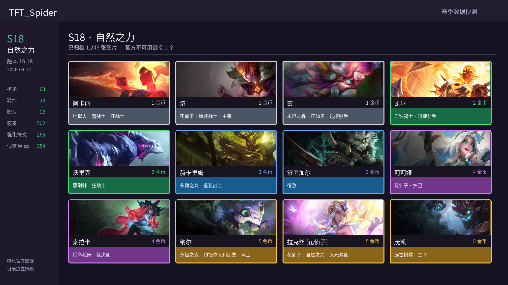

# TFT_Spider

云顶之弈赛季数据归档与爬取工具。仓库按赛季保存完整快照，包括爬虫代码、
JSON 数据、处理后的 Python 数据类以及配套图片。

当前最新赛季：**[S18 · 自然之力](seasons/s18/)**（版本 16.18）



## 赛季目录

| 赛季 | 主题 | 数据版本 | 快照/恢复日期 | 完整内容 |
| --- | --- | --- | --- | --- |
| S18 | 自然之力 | 16.18 | 2026-09-17 | [seasons/s18](seasons/s18/) |
| S17 | 星神 | 16.17 | 2026-09-17 | [seasons/s17](seasons/s17/) |
| S16 | 英雄联盟传奇 | 16.7 | 2026-09-17 | [seasons/s16](seasons/s16/) |
| S15 | 天下无双格斗大赛 | 15.16 | 2025-08-17 | [seasons/s15](seasons/s15/) |
| S14 | 赛博之城 | 15.8 | 2025-04-25 | [seasons/s14](seasons/s14/) |
| S13 | 双城之战 2 | 14.24 | 2024-12-19 | [seasons/s13](seasons/s13/) |
| S12 | 魔法大乱斗 | 14.15 | 2024-08-07 | [seasons/s12](seasons/s12/) |
| S11 | 画中灵 | 14.9 | 2024-05-04 | [seasons/s11](seasons/s11/) |
| S10 | 强音争霸 | 13.23 | 2023-11-23 | [seasons/s10](seasons/s10/) |
| S9.5 | 志在天际 | 13.18 | 2026-09-17 | [seasons/s9.5](seasons/s9.5/) |
| S9 | 符文大陆传奇 | 13.12 | 2026-09-17 | [seasons/s9](seasons/s9/) |
| S8.5 | 怪兽来袭：铲铲市危机！ | 13.10 | 2023-05-19 | [seasons/s8.5](seasons/s8.5/) |
| S8 | 怪兽来袭 | 13.5 | 2023-03-18 | [seasons/s8](seasons/s8/) |
| S7.5 | 隐秘海域 | 12.17 | 2026-09-17 | [seasons/s7.5](seasons/s7.5/) |
| S7 | 巨龙之境 | 12.11 | 2026-09-17 | [seasons/s7](seasons/s7/) |
| S6.5 | 霓虹之夜 | 12.4 | 2026-09-17 | [seasons/s6.5](seasons/s6.5/) |
| S6 | 双城之战 | 11.22 | 2026-09-17 | [seasons/s6](seasons/s6/) |
| S5.5 | 英雄之黎明 | 11.15 | 2026-09-17 | [seasons/s5.5](seasons/s5.5/) |
| S5 | 光明与黑暗 | 11.9 | 2026-09-17 | [seasons/s5](seasons/s5/) |
| S4.5 | 瑞兽闹新春 | 11.2 | 2026-09-17 | [seasons/s4.5](seasons/s4.5/) |
| S4 | 命运之轮 | 10.19 | 2026-09-17 | [seasons/s4](seasons/s4/) |
| S3.5 | 再战星海 | 10.12 | 2026-09-17 | [seasons/s3.5](seasons/s3.5/) |
| S3 | 银河战争 | 10.6 | 2026-09-17 | [seasons/s3](seasons/s3/) |
| S2 | 元素崛起 | 9.22 | 2026-09-17 | [seasons/s2](seasons/s2/) |
| S1 | 初代赛季 | 9.21 | 2026-09-17 | [seasons/s1](seasons/s1/) |

S8–S18 优先保留仓库历史中的完整快照；仓库历史缺失的 S1–S7.5、S9 和 S9.5
使用腾讯官方历史静态接口恢复。每个恢复目录都包含固定版本配置、原始与处理后数据、
有效图片、失效图片链接审计和可复现脚本。S1–S5.5 尚未引入强化符文；S6 的腾讯
历史强化符文文件未公开保留，因此该项明确记为缺失，不使用第三方数据填补。

## 使用最新赛季

```bash
git clone https://github.com/Jack0Chan/TFT_Spider.git
cd TFT_Spider/seasons/s18
pip install -r requirements.txt
python main.py --season s18
```

只使用已归档数据时无需运行爬虫：

- 文本数据：`seasons/<赛季>/tft_data/`
- 图片数据：`seasons/<赛季>/tft_images/`
- 赛季说明：`seasons/<赛季>/README.md`

S16、S17、S18 支持通过 `--season` 显式指定赛季，并可通过 `--workers` 调整
图片下载并发数，或使用 `--skip-images` 只刷新 JSON 和 `TFTData.py`。旧赛季请按
对应目录 README 中的命令运行。

S8～S15 的历史接口未固定到对应版本，因此 `python main.py` 默认只使用目录内的
原始快照离线重建处理数据，避免被当前赛季覆盖。旧版联网行为仅在显式传入
`--refresh-current` 时启用。

缺失于原仓库历史的赛季可用固定官方端点批量复现：

```bash
python scripts/rebuild_historical_seasons.py --workers 24
```

该命令覆盖 S1–S7.5、S9 和 S9.5；S8 使用仓库历史提交保存，S8.5 及之后使用原有
赛季快照保存。

## 校验全部赛季

以下命令会以只读方式逐赛季检查入口参数、Python 语法、JSON 数据结构、赛季标识
以及全部归档图片：

```bash
python scripts/check_all_seasons.py
```

快速检查可增加 `--quick`，跳过对 `tft_images/` 中每张图片的完整解码。

数据来源：[腾讯官方云顶之弈主题站](https://lol.qq.com/tft/#/champion)

## Star History

[](https://www.star-history.com/#Jack0Chan/TFT_Spider&Date)
