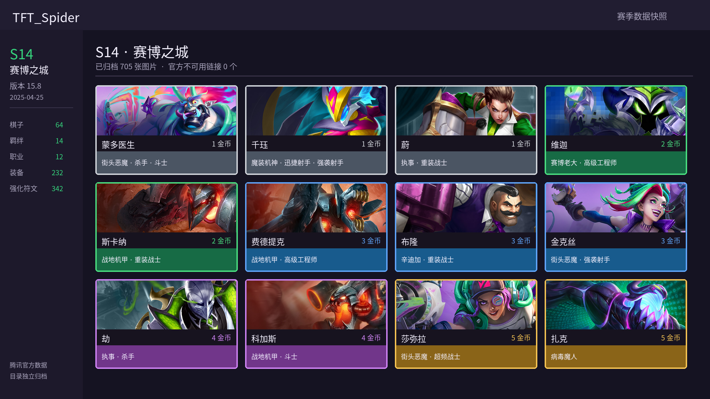

# TFT_Spider — S14 赛博之城

仓库历史赛季快照。数据版本 `15.8`，快照日期 `2025-04-25`。



## 数据概览

| 类型 | 数量 |
| --- | ---: |
| 棋子 | 64 |
| 种族羁绊 | 14 |
| 职业羁绊 | 12 |
| 装备 | 232 |
| 强化符文 | 342 |
| 已归档图片 | 705 |
| 官方失效图片链接 | 未单独审计 |

## 目录

- 原始数据：`tft_data/tft_raw_data.json`
- 处理数据：`tft_data/tft_processed_data.json`
- Python 数据类：`tft_data/TFTData.py`
- 图片目录：`tft_images/`
- README 图片生成器：`scripts/generate_readme_images.py`

## 使用

```bash
pip install -r requirements.txt
python main.py
python scripts/generate_readme_images.py --season s14
```

数据来源：[腾讯官方云顶之弈静态资源](https://game.gtimg.cn/)
