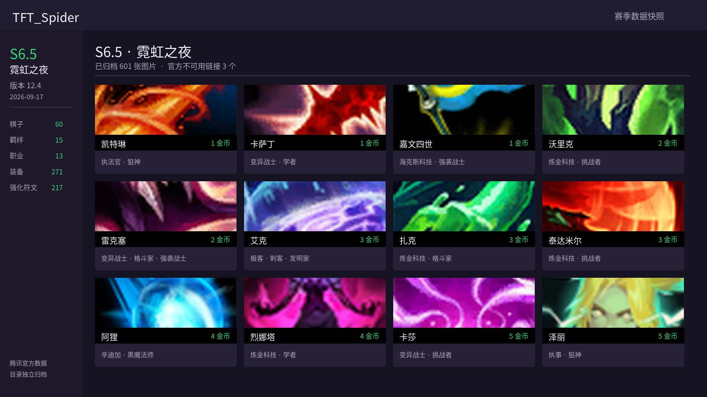
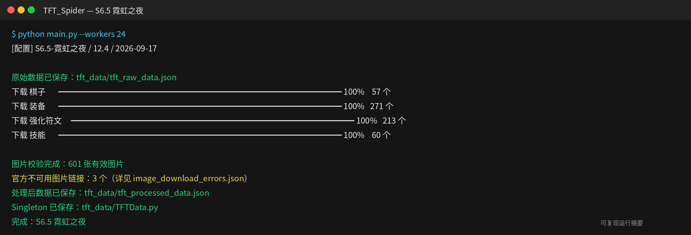

# TFT_Spider — S6.5 霓虹之夜

腾讯官方历史版本 `12.4-2022.S6` 的自包含恢复快照，数据版本
`12.4`，于 `2026-09-17` 恢复并校验。



## 内容

| 类型 | 数量 |
| --- | ---: |
| 棋子 | 60 |
| 种族羁绊 | 15 |
| 职业羁绊 | 13 |
| 装备 | 271 |
| 强化符文 | 217 |
| 官方失效图片链接 | 3 |

- 原始数据：`tft_data/tft_raw_data.json`
- 处理数据：`tft_data/tft_processed_data.json`
- Python 数据类：`tft_data/TFTData.py`
- 图片错误审计：`tft_data/image_download_errors.json`
- 图片目录：`tft_images/`

## 重新构建

```bash
pip install -r requirements.txt
python main.py --workers 24
python scripts/generate_readme_images.py --season s6.5
```

数据来源：[腾讯官方云顶之弈历史静态资源](https://game.gtimg.cn/)


