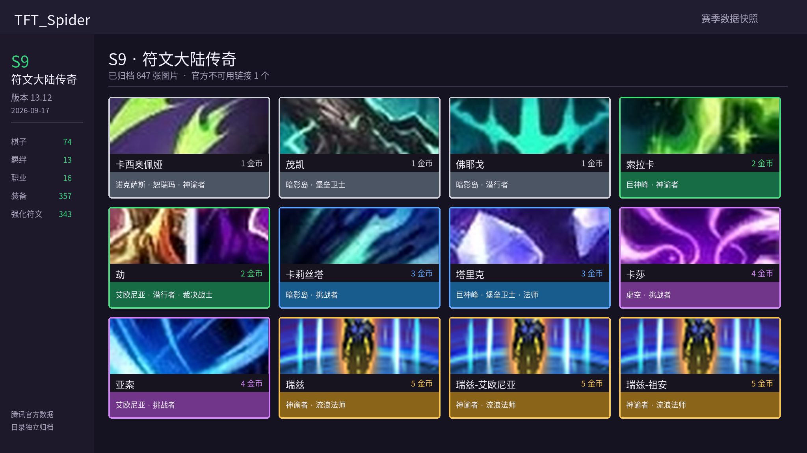

# TFT_Spider — S9 符文大陆传奇

腾讯官方历史静态接口恢复。数据版本 `13.12`，快照日期 `2026-09-17`。



## 数据概览

| 类型 | 数量 |
| --- | ---: |
| 棋子 | 74 |
| 种族羁绊 | 13 |
| 职业羁绊 | 16 |
| 装备 | 357 |
| 强化符文 | 343 |
| 已归档图片 | 847 |
| 官方失效图片链接 | 1 |

## 目录

- 原始数据：`tft_data/tft_raw_data.json`
- 处理数据：`tft_data/tft_processed_data.json`
- Python 数据类：`tft_data/TFTData.py`
- 图片错误审计：`tft_data/image_download_errors.json`
- 历史接口配置：`season_config.json`
- 图片目录：`tft_images/`
- README 图片生成器：`scripts/generate_readme_images.py`

## 使用

```bash
pip install -r requirements.txt
python main.py --workers 24
python scripts/generate_readme_images.py --season s9
```

数据来源：[腾讯官方云顶之弈静态资源](https://game.gtimg.cn/)
